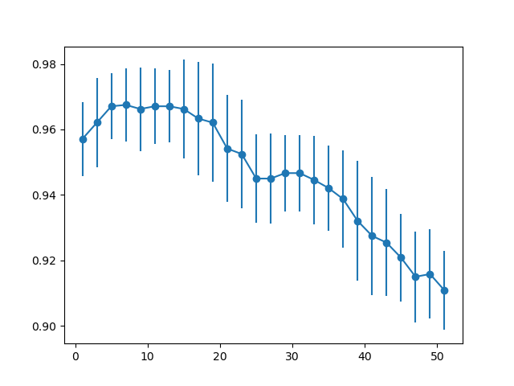
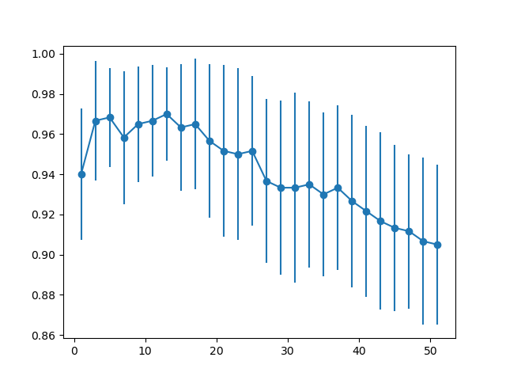
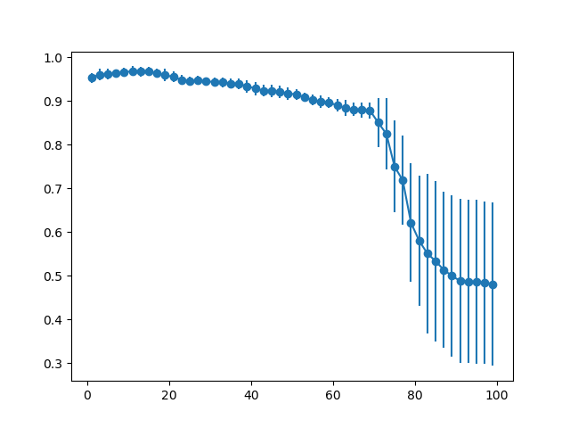
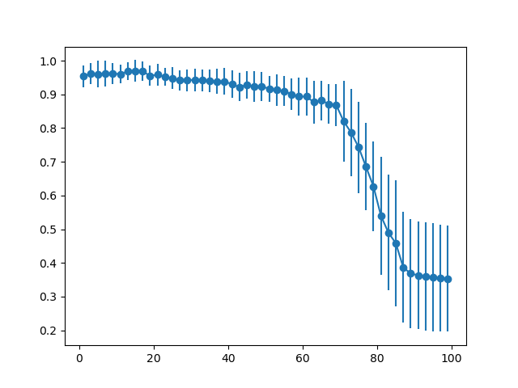
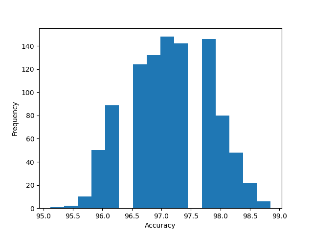
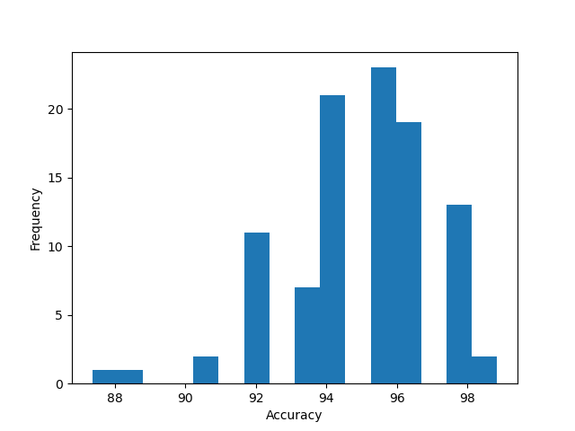
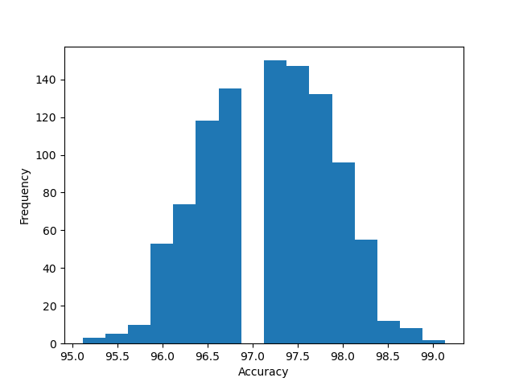
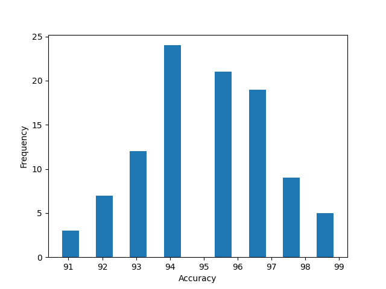

# K Nearest Neighbors and Decision Tree

## Question 1
1. Accuracy on the training set (k is odd numbers from 1 to 51) (line shows the average accuracy and standard deviation after 20 runs).

2. Accuracy on the test set (line shows the average accuracy and standard deviation after 20 runs)

3. The training set's curve's highest points are in the range from 3 - 17. That of the test set is from 3 - 15. 
The reason is that as k gets too small or too large, the predictions made by k-NN algorithm become less accurate.
For example, if k is close to 1, instances near the bounding line will make the predictions wrong (as they may nearer to
a differnt type than its own). If k is close to the size of the training set, the predictions made will be made based
on the majority of points (and return the type of iris that is most popular). Both of the cases are not what we want, so 
k should be in the range above [3, 16] for the algorithm to yield accurate predictions.
  

4. The model performs well on both training set and test set for k in range [3, 15].  
Graph on the training set when k ranges to 100  
  
Graph on the test set when k ranges to 100  
  
In both graph, when k is larger than 17, the accuracy of predictions decreases. This is where the model is underfitting.
There is no point in the graph that the model is overfitting. If the models performs well in the training set, the test set also performs well

5. Based on the observations made, I choose k to be 14. As if k gets out of the range described above, the model becomes underfitting.

## Question 2
1. Average Accuracy:  97.158908045977  
   Standard Deviation:  0.6608090237434326  

2. Average Accuracy:  94.96551724137932  
   Standard Deviation:  2.118063664002292  

3. The accuracy achieved in the training set is higher than one in the test set.
In the test set, the variance is higher. This is because there are many (15) parameters that affect the outcome of the algorithms.
The more parameters, the higher the variance of the test set.

4. On comparing the histograms of the two set, I see that the model performs reasonably well, since both cases yield an
average accuracy as high as 94%, and there is no point in the test set and the training set that the model is over- or underfitting

5. A Decision Tree may be non-robust since for each different dataset, a new tree is created. 
To confirm this property, we can look at the standard deviation of the test set and training set. Standard deviation of the
test set is higher than that of the training set.
  
Now using Gini index instead of Information gain
1.When use on training set:    
Average Accuracy:  97.16522988505749  
Standard Deviation:  0.6911367586498992  

2.When use on test set:  
Average Accuracy:  95.06896551724138   
Standard Deviation:  1.904684755812619  

