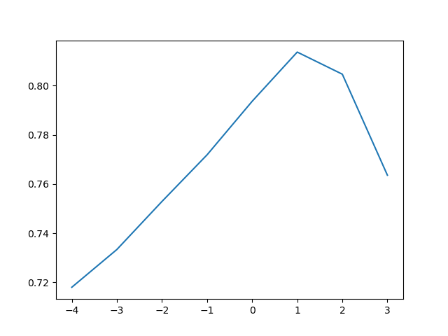

# Homework 2  
## Question 1:  
Predict without using log trick  
Accuracy:  0.5246138456297698  
Confusion Matrix:  {'TP': 1316, 'FN': 1228, 'FP': 1158, 'TN': 1316}  
Precision:  0.5319320937752627  
Recall:  0.5172955974842768  

Predict with using log trick  
Accuracy:  0.5861808722665405  
Confusion Matrix:  {'TP': 1402, 'FN': 1142, 'FP': 937, 'TN': 1537}  
Precision:  0.599401453612655  
Recall:  0.5511006289308176  

Using the log-probabilities to predict the model results in more accurate predictions (both higher recall, precision, 
and accuracy). This is because a text may contain word that has never been seen by the model before, thus if we don't
use log, this would result in a zero probability. This is a breaking tie, and we have to decide its class at random.
When we do use log, if a zero probability is encountered, we set it to log(1), which means we implicitly say that the
probability of this word present in both classes is 1. "This should not change the results significantly" - Professor
Silva, but one good side is that it will take into account other words of this text, and compute their probability rather than 
completely ignore them when we don't use log (since all other words' probability when multiplied with zero becomes zero).

Also, since we are multiplying very small probability together, the product will quickly get closer to zero. Computing 
this on a computer may give you a straight zero after several multiplies, since it can't handle too many digits.
Applying log solves the problem, log(a*b) = log(a)+log(b) and one thing important is that it will not change the class
predicted by the model.

---
## Question 2:
Plot between alpha and accuracy. (x-axis is alpha after using log scale, y-axis represents corresponding accuracy)
  
Accuracy is highest when alpha = 10.  Depend on the size of the dataset, we may want to select different alpha for 
better performance. Since our dataset is quite large (5000 instances in each training and test set), choosing a too 
small alpha may be less accurate since it doesn't affect the probability significantly, while an alpha greater than 10 results in a biased model since it alpha now dominates the probability.

---
## Question 3:
Alpha: 10  
Accuracy: 0.8388868865647627   
Confusion Matrix: {'TP': 1974, 'FN': 526, 'FP': 278, 'TN': 2208}  
Precision: 08765541740674956  
Recall: 0.7896  
___
## Question 4:
Alpha:  10  
Accuracy:  0.83348  
Confusion Matrix:  {'TP': 9816, 'FN': 2684, 'FP': 1479, 'TN': 11021}  
Precision:  0.8690571049136786  
Recall:  0.78528  

Using a smaller training set may result in a slightly smaller accuracy. This is because using 50% of the training set 
may be good enough for our model's learning. The ratio between each component of the confusion matrix stays the same, 
but these numbers increases when we use a larger test set. That is, there is no particular class that is affected if we 
do change the size of test set but still keeps the same ratio between negative and positive instances.

---
## Question 5:
In this application (classifying movie reviews), a higher accuracy is more important than precision and recall. This is 
because we are more interested in how people see the movie, whether it is good or bad. Missing one positive instance is 
as bad as missing one negative instance. Detecting relevant instances (recall) and avoiding making wrong detection
(precision) are equally important then. Thus, it is better to have a higher general accuracy.

---
## Question 6:
Alpha:  10  
Accuracy:  0.50064  
Confusion Matrix:  {'TP': 18, 'FN': 12482, 'FP': 2, 'TN': 12498}  
Precision:  0.9  
Recall:  0.00144  

When trained with an unbalanced training set, the model will tend to produce predictions of the classes it is more
familiar with in the training process. In this case, the number of negative reviews is 5 times more than the positive 
one, thus the model will produce more negative results in the future. This is reflected in the confusion matrix: the 
number of negative results (TN+FN) made is much more that of positive results. The precision, though, is high but
unreliable since we have too little positive predictions to make any judgement about whether this model will work more 
accurately on positive instances. For negative instances, the model predicts poorly. As the model's training set has 
more negative instances, the model will make significantly more predictions of this class, but that is not the case in 
the test set, where we have the same amount of classes. This will make a model that favors a particular class to predict 
poorly.