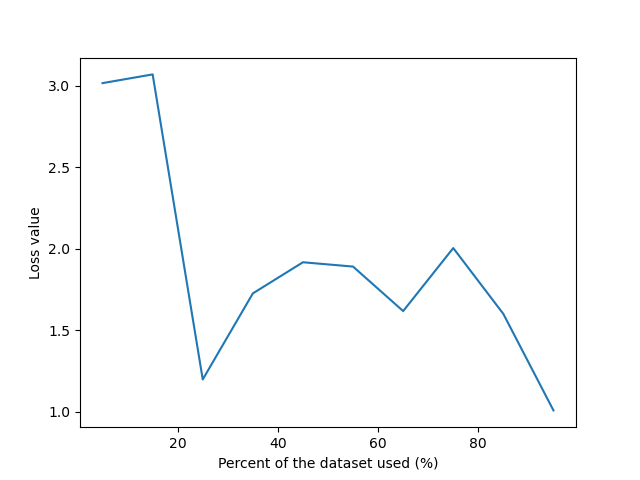

# Neural Network

### How to run the test examples:

There is a file call `testExample.py`. Uncomment line 90 or 91 to test example 1 or 2, respectively. My output vector's
dimension is a little different from that of the one provided in the examples because, instead of propagating the
instances one by one, I chunked them into a big matrix and propagate. So, for example, two instances X `[1,2]`
and `[3,4]` will become `[[1,3], [2,4]]`. Other than the difference of the dimension, the values computed are the
identical.

Other files are `NN.py` and `plotJ.py`. Run `NN.py` to check accuracy and F1 score of each dataset (go to line 171 to
and change the parameter for `processData` as instructed to switch between datasets). Run `plotJ.py` to see the loss vs
training set size graph (again, go to line 170 for instruction on how to switch between dataset). Adjust variable
`kFolds` to change the number of folds.

### Architectures I will be using:

P/s: `first` and `last` are the number of attributes and classes of the dataset.  
1: `[first, 4, last]`, `lamba = 0.1`, `alpha = 1`, `noIter = 5000`    
2: `[first, 50, last`, `lamba = 0.000001`, `alpha = 1.05`, `noIter = 5000`        
3: `[first, 10, 10, last]`,  `lamba = 0.000001`, `alpha = 1.05`, `noIter = 5000`      
4: `[first, 16, 8, last]`,  `lamba = 0.1`, `alpha = 1`, `noIter = 5000`    
5: `[first, 40, 20, 10, last]`,  `lamba = 0.1`, `alpha = 1`, `noIter = 5000`     
6: `[first, 128, 64, 32, last]`,  `lamba = 0.1`, `alpha = 1`, `noIter = 5000`    
7: `[first, 10, 10, 10, 10, last]`,  `lamba = 0.1`, `alpha = 1`, `noIter = 5000`      
8: `[first, 16, 16, 16, 16, 16, last]`,  `lamba = 0.1`, `alpha = 1`, `noIter = 5000`

| #   | Wine Acc | Wine F1 | Vote Acc | Vote F1 | Cancer Acc | Cancer F1 | CMC Acc | CMC F1 |
|-----|----------|---------|----------|---------|------------|-----------|---------|--------|
| 1   | 0.69666  | 0.51834 | 0.949425 | 0.94648 | 0.9198561  | 0.911150  | 0.52106 | 0.3930 |
| 2   | 0.71998  | 0.61442 | 0.947126 | 0.94358 | 0.9084686  | 0.8983257 | 0.49661 | 0.3398 |
| 3   | 0.696507 | 0.56966 | 0.937931 | 0.93447 | 0.931305   | 0.9240185 | 0.52716 | 0.3879 |
| 4   | 0.673968 | 0.52978 | 0.947126 | 0.94395 | 0.9026721  | 0.8932776 | 0.54547 | 0.4203 |
| 5   | 0.67492  | 0.56878 | 0.944827 | 0.94189 | 0.89985    | 0.88863   | 0.52650 | 0.4032 |
| 6   | 0.64619  | 0.4862  | 0.951724 | 0.94912 | 0.8955704  | 0.883278  | 0.52542 | 0.3796 |
| 7   | 0.659587 | 0.56552 | 0.949425 | 0.9465  | 0.91428    | 0.904891  | 0.53220 | 0.4168 |
| 8   | 0.657303 | 0.54452 | 0.9378   | 0.93371 | 0.896975   | 0.8867822 | 0.47826 | 0.3294 |

### Discuss:

Depend on the nature of the dataset, adjusting a particular parameter may have different effect. For example, in the
wine dataset, increasing lambda causes the network to ignore important features, which should be avoided since this
dataset in order to predict the true labels, we need to take into account these ignored features. Decreasing lambda, on
the other hand, may sometimes result in less accuracy.   
Learning rate alpha and the number of iterations (noIter) can compensate for each other. For instance, if we wish to
decrease alpha to achieve more accurate update for the weights, we may have to increase the number of iterations so that
the network is trained sufficiently. If noIter or alpha are too high, then the model become overfit. Otherwise, if
noIter or alpha too low, the model becomes underfit.  
The number of layers and neurons of each layer plays an important role to the overall accuracy of each training dataset.
The Wine dataset gives the best performance when the model is trained with the 2nd architecture of 1 layer. Other
datasets, like the House of Vote, requires more sophisticated architectures to make better predictions. This is because,
by increasing the number of layers and number of neurons in each one, the model introduces more features that are
necessary to predict. To better accommodate these two parameters, we may want to adjust lambda alongside to have the
best performance.  
In real life, again, we have to look at the nature of the datasets to decide whether to use a sophisticated or simple
architecture. If that dataset has many hidden features that can be derived from the original input, for example, the
Boston house prices dataset, we can derive the number of toilets/bedrooms, bedrooms/floor,... from the input. When many
features are introduced, and we don't want the model to be overfit, we can opt to increase lamba to penalize use of
complicated features.

### Graphs between number of instances used and the network's performance

#### Dataset 1: Wine

Architecture used: #2   
Adjusted lambda: 0.000001  
Adjusted alpha: 1.05  

#### Dataset 2: House of votes

Architecture used: #6  
Adjusted lambda: 0.01  
Adjusted alpha: 1.05  

#### Dataset 3: Breast cancer

Architecture used: #3   
Adjusted lambda: 0.1  
Adjusted alpha: 1.05  

#### Dataset 4: Contraceptive

Architecture used: #4  
Adjusted lambda: 0.00001  
Adjusted alpha: 1.05  

