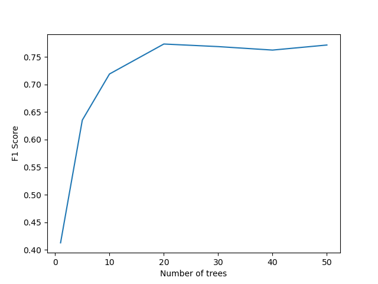
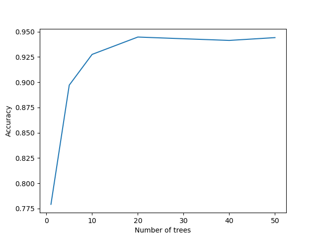
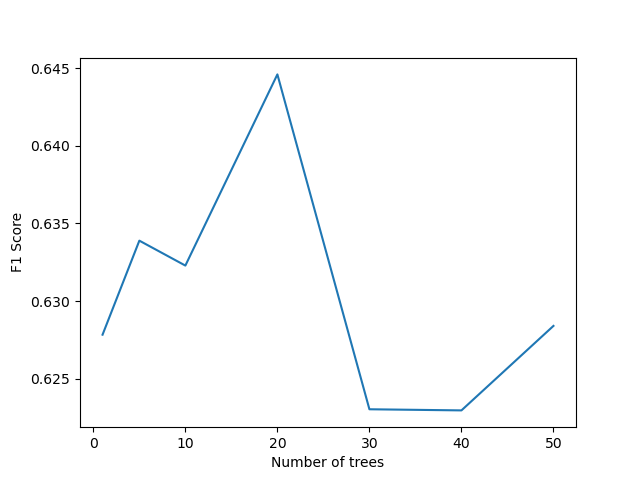
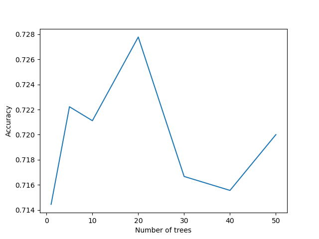
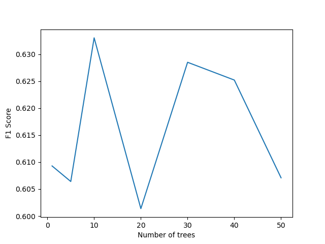
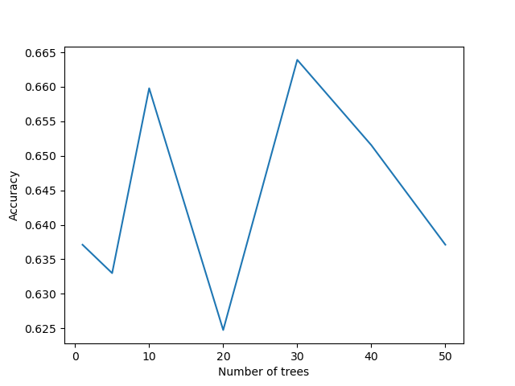
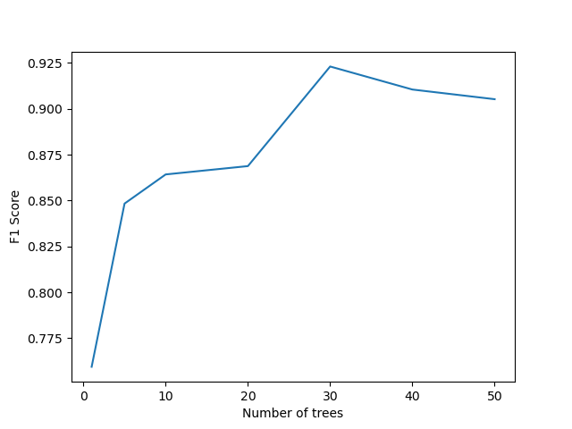
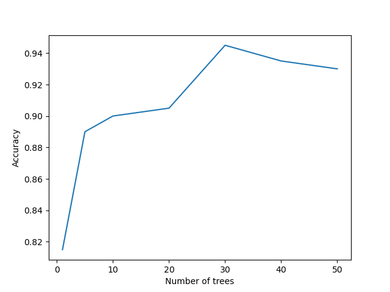
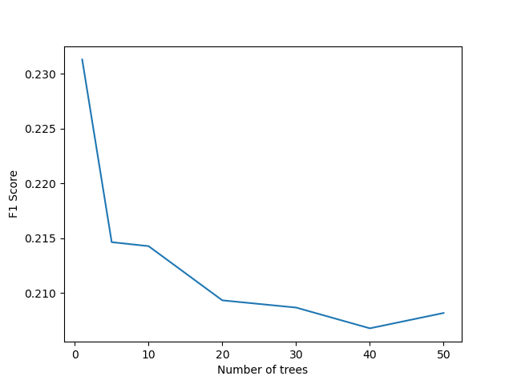
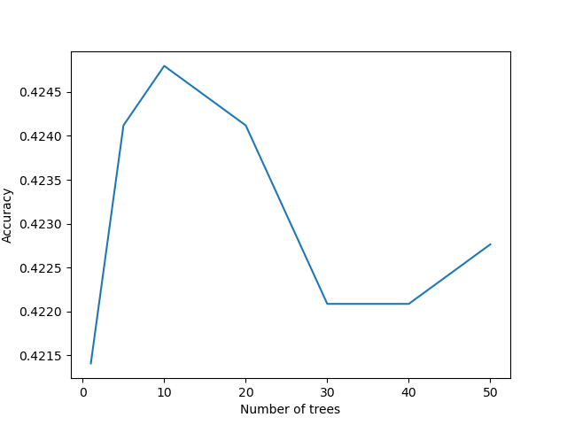

# Final project
## Dataset 1: Handwriting digits
### F1 Score:   

### Accuracy:   

------
## Dataset 2: Titanic survivors
### F1 Score:  

### Accuracy:  

------
## Dataset 3: Loan eligibility
### F1 Score: 

### Accuracy:  

------
## Dataset 4: Oxford Parkinson
### F1 Score:   

### Accuracy:  
  

------
## Dataset 5: Contraceptive
### F1 Score:  
  
### Accuracy:  
  